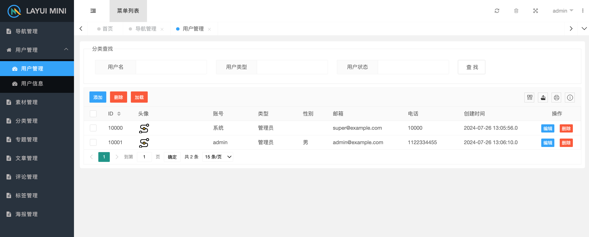

#### CMS Content Management System

#### Project Introduction

 - Target audience: Servlet beginners

#### Test environment

 - Machine platform macOS Monterey 12.7.5
 - MySQL version 5.7
 - Java version jdk-8u421-macosx-x64
 - Apache Tomcat version apache-tomcat-9.0.91
 - Maven version IDEA bundled version Maven3
 - Front end interface framework - LayUI
   - LayUI GitHub repository address:
     - https://github.com/zhongshaofa/layuimini/tree/onepage
   - LayUI Gitee repository address:
     - https://gitee.com/zhongshaofa/layuimini/tree/onepage

#### Technology Stack

 - Back end: Servlet+JDBC+MySQL+JSON
 - Front end: LayUi+jQuery+Ajax+JSON+HTML+CSS+JS
 - Development tools: IDEA+Maven+Tomcat

#### deploy
 - Create database tables based on: 
   - doc/mysql-creat-table.sql
 - Modified: 
   - src/main/resources/application.properties

#### Demonstration

